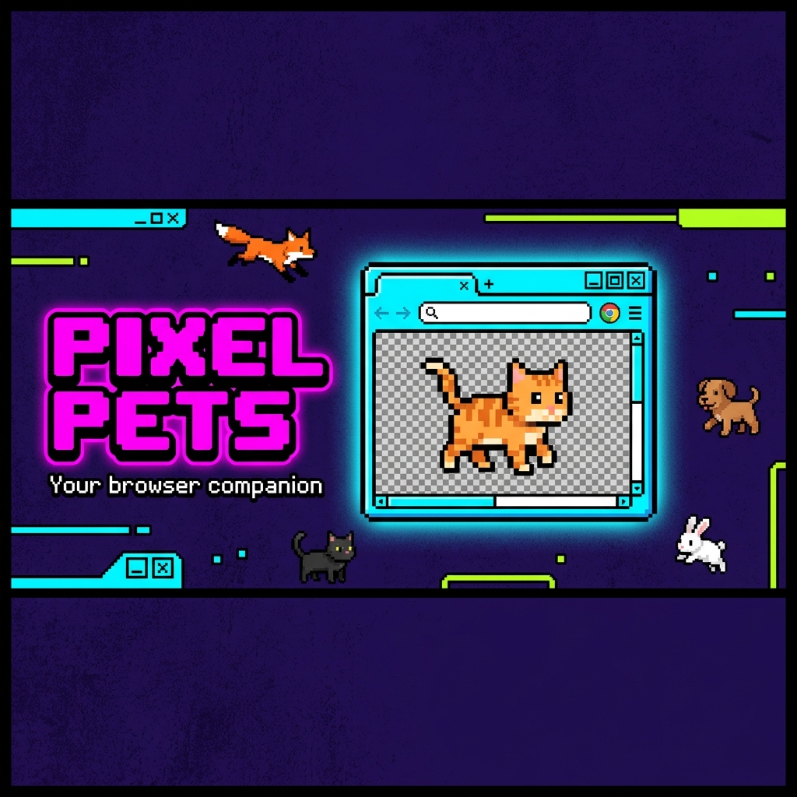
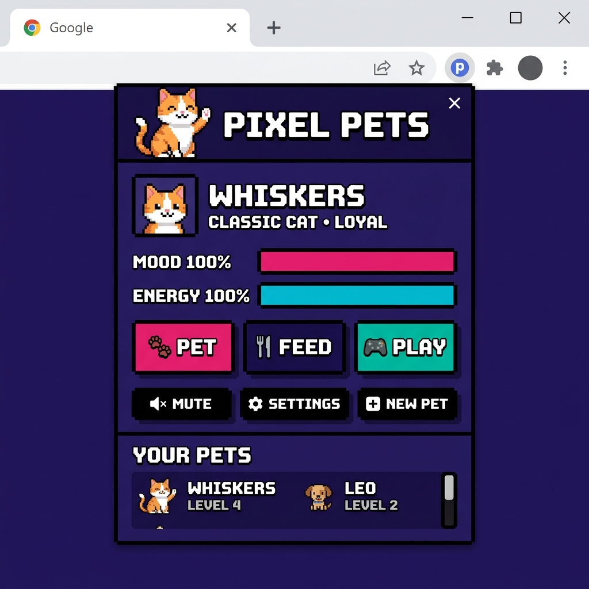
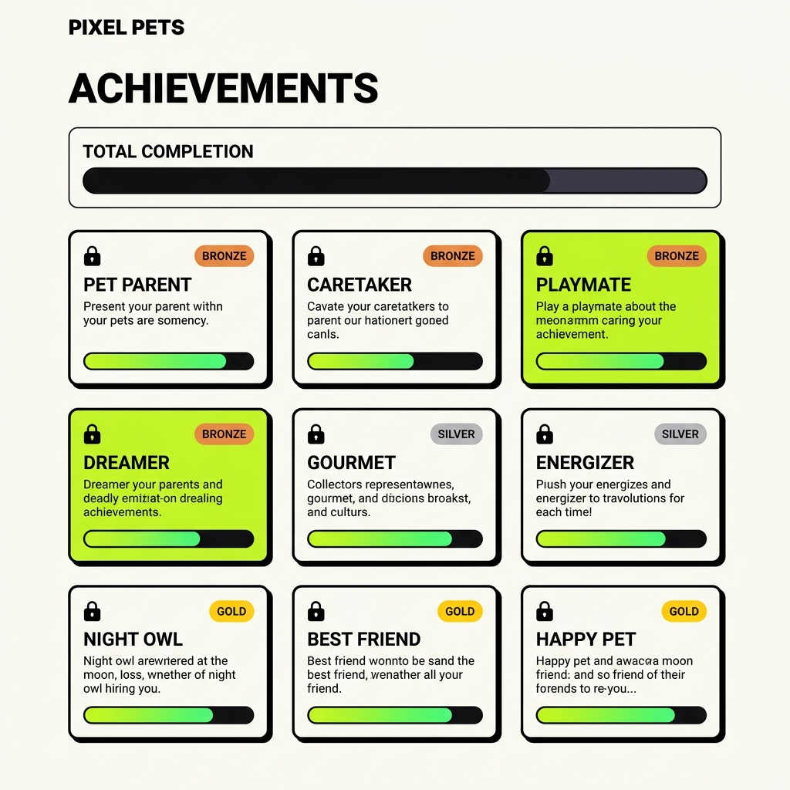
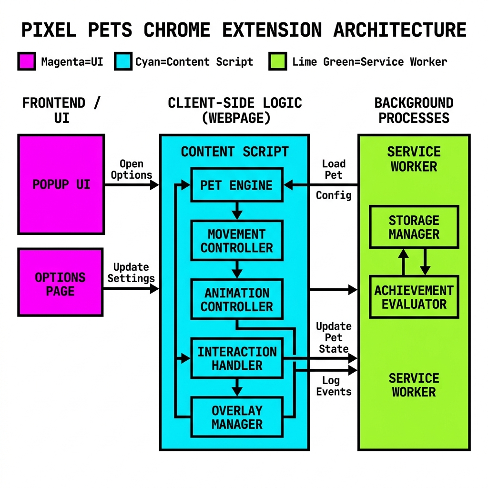

<div align="center">



<h1>🐾 PIXEL PETS</h1>

**Your adorable pixel companion that lives on every webpage.**  
A fully-featured Chrome Extension built with Vanilla JS, Canvas 2D, and a Neo-Brutalism design system.

[](https://github.com/dARSHANdR4/pixel-pets)
[](https://developer.chrome.com/docs/extensions/mv3/)
[](https://chrome.google.com/webstore)
[](https://developer.mozilla.org/en-US/docs/Web/JavaScript)
[](LICENSE)

<br/>

<a href="https://chromewebstore.google.com/detail/pixel-pets/fpkgdncikincjddlpibdhaaefjfoelga">
  
</a>
&nbsp;
<a href="https://github.com/dARSHANdR4/pixel-pets">
  
</a>

<br/><br/>

[](https://chromewebstore.google.com/detail/pixel-pets/fpkgdncikincjddlpibdhaaefjfoelga)
[](https://developer.chrome.com/docs/extensions/mv3/)
[](#-trd--technical-spec)
[](#-trd--technical-spec)
[](#-features)
[](#-achievements)

[🚀 Install](#-installation) • [Features](#-features) • [Architecture](#-architecture) • [Installation](#-installation-developer-mode) • [PRD](#-prd--product-vision) • [TRD](#-trd--technical-spec) • [UI/UX](#-uiux-design-brief) • [App Flow](#-app-flow) • [Achievements](#-achievements)

</div>

---

## 🚀 Live Deployment

Pixel Pets is now **officially available** on the Chrome Web Store — no developer mode, no ZIP files, just one click.

<p align="center">

<a href="https://chromewebstore.google.com/detail/pixel-pets/fpkgdncikincjddlpibdhaaefjfoelga">
  
</a>

</p>

👉 **[Install Pixel Pets — Chrome Web Store](https://chromewebstore.google.com/detail/pixel-pets/fpkgdncikincjddlpibdhaaefjfoelga)**

> ⭐ If you enjoy it, consider **[starring this repository](https://github.com/dARSHANdR4/pixel-pets)** — it really helps!

### 🌟 Why Install from the Store?

| | Chrome Web Store | Developer Mode |
|---|---|---|
| **Setup** | 1 click | Clone + load unpacked |
| **Updates** | Auto-updated | Manual pull required |
| **Stability** | Store-reviewed build | Local dev build |
| **Recommended for** | Everyone | Contributors / Developers |

---

### 💬 Social Proof

⭐ **Chrome Web Store** — Publicly Listed  
✅ **Manifest V3** — Latest Chrome Standard  
🔒 **Zero Tracking** — 100% Private  
💯 **100% Local** — All data on your device  
🎮 **10 Pixel Pets** — Classic Cat, Black Cat, Puppy, Bunny, Fox, Ghost & more  
🏆 **10 Achievements** — Bronze, Silver & Gold tiers  
⚡ **< 5% CPU** — Lightweight & battery-friendly  
🚀 **Manifest V3** — Future-proof Chrome extension standard  

---

## 🎮 What Is Pixel Pets?

Pixel Pets is a **Manifest V3 Chrome Extension** that spawns a lovable, animated pixel-art companion directly on top of any webpage you browse. Inspired by the classic 1990s Oneko Neko cursor cat — but rebuilt from the ground up with a complete game engine, personality system, tiered achievement framework, and a custom Neo-Brutalism design language.

Your pet follows your cursor, reacts to your behavior, gets hungry, sleepy, and excited. Feed it, play with it, pet it, and unlock Bronze, Silver, and Gold achievements as you spend time together.

> **No frameworks. No external dependencies. 100% Vanilla JavaScript. All data stored locally — zero tracking.**

---

## 📸 Screenshots & Preview

<div align="center">

| Popup Dashboard | Achievements Page |
|:-:|:-:|
|  |  |
| Live mood & energy bars, Feed/Play/Pet actions | Bronze / Silver / Gold tiered progress tracker |

</div>

### System Architecture

<div align="center">



</div>

---

## ✨ Features

### 🐱 Pet System
- **6+ built-in pet types** — Classic Cat, Black Cat, Puppy, Bunny, Fox, Ghost, and more
- **Up to 5 simultaneous pets** on the same page
- **Live Mood & Energy stats** — displayed in the popup with animated bars
- **Organic stat decay** — mood declines at 0.5%/min, energy at 0.3%/min over time
- **Sleep cycle** — pets fall asleep automatically when energy drops below 15%

### 🤸 Personality System
| Personality | Behaviour | Speed Modifier |
|-------------|-----------|---------------|
| 🦥 Lazy | Moves slowly, sleeps often | 0.6× |
| ⚡ Energetic | Random zoomies, high activity | 1.5× |
| 🔍 Curious | Explores page edges | 1.0× |
| ❤️ Loyal | Stays tightly close to cursor | 1.2× |
| 🌪️ Chaotic | Unpredictable random movements | 1.5× |

### 🎮 Interactions
| Action | Mood Δ | Energy Δ | Particle Effect |
|--------|--------|----------|-----------------|
| 🐾 Pet | +15 | — | Hearts burst |
| 🐟 Feed (Fish) | +30 | +20 | Food sparkles |
| 🍖 Feed (Meat) | +25 | +25 | Food sparkles |
| 🍪 Feed (Treat) | +35 | +10 | Stars |
| ⚽ Play (Ball) | +25 | −15 | Sparkles |
| 🧶 Play (Yarn) | +20 | −10 | Sparkles |
| 🐭 Play (Mouse) | +30 | −20 | Sparkles |
| 🔴 Play (Laser) | +35 | −25 | Sparkles |
| 💤 Sleep | — | Recharges | ZZZ bubbles |

### 🏆 Achievement System
A full three-tier gamified achievement engine:

| Tier | Color | Achievements |
|------|-------|-------------|
| 🥉 Bronze | `#CD7F32` | Pet Parent, Caretaker, Playmate, Dreamer |
| 🥈 Silver | `#C0C0C0` | Collector, Gourmet, Energizer |
| 🥇 Gold | `#FFD700` | Night Owl, Best Friend, Happy Pet |

- **Individual progress bars** per achievement (neon green, Neo-Brutalism style)
- **Mega Progress Bar** tracking total completion across all 10 achievements
- **Gamified toast notifications** slide in from the right — tier-colored, bold, full Neo-Brutalism styling
- **Real-time soft refresh** — progress bars update live without page reload

### 🎨 Appearance Customization
- Pet size slider (32px – 128px)
- Movement speed slider (0.25× – 2.0×)
- Animation speed slider (0.25× – 3.0×)
- Opacity control (20% – 100%)
- Pet renaming

### ⚙️ Settings Page (5 Tabs)
1. **General** — Enable/disable, performance mode, auto-startup
2. **Pets** — Manage, add, delete pets; select personalities & types
3. **Appearance** — Size, speed, opacity, animation controls
4. **Audio** — Mute toggle, volume slider
5. **Advanced** — Debug mode, reset to defaults, clear all data, achievement tracker

---

## 🏗️ Architecture

```
pixel-pets/
├── manifest.json               # MV3 extension manifest
├── background/
│   └── service-worker.js       # Extension lifecycle, storage, achievement evaluator
├── content/
│   ├── pet-engine.js           # Main game loop (requestAnimationFrame)
│   ├── movement.js             # Cursor tracking, pathfinding, boundary collision
│   ├── animations.js           # Sprite animation state machine
│   ├── interactions.js         # Input handling, particle effects, feedback
│   ├── overlay.js              # Shadow DOM layer, Canvas 2D renderer, toast UI
│   └── overlay.css             # Scoped overlay styles
├── popup/
│   ├── popup.html              # Extension popup (320px)
│   ├── popup.js                # Popup controller, action dispatcher
│   └── popup.css               # Neo-Brutalism popup styles
├── options/
│   ├── options.html            # Full settings page
│   ├── options.js              # Settings controller, achievement renderer
│   └── options.css             # Neo-Brutalism settings styles
├── lib/
│   ├── constants.js            # Shared config: colors, pets, achievements, interactions
│   ├── pet-factory.js          # Pet sprite renderer (Canvas 2D pixel art)
│   └── storage-manager.js      # Chrome Storage API abstraction layer
├── docs/
│   └── images/                 # Banner, architecture diagram, screenshots
└── assets/
    ├── pets/                   # Pixel-art pet sprite definitions
    ├── icons/                  # Extension icons (16, 48, 128px)
    ├── sounds/                 # Audio files (opt-in, default OFF)
    └── accessories/            # Cosmetic item assets
```

### Messaging Architecture

```
┌─────────────────┐     chrome.tabs.sendMessage      ┌──────────────────────┐
│  POPUP / OPTIONS │ ─────────────────────────────▶  │   CONTENT SCRIPT     │
│  (Extension UI)  │                                  │   (Page Overlay)     │
│                  │ ◀─────────────────────────────  │                      │
└────────┬─────────┘      response / resolve          │  PetEngine           │
         │                                            │  MovementController  │
         │ chrome.runtime.sendMessage                 │  AnimationController │
         ▼                                            │  InteractionHandler  │
┌─────────────────┐                                   │  OverlayManager      │
│ SERVICE WORKER  │                                   └──────────────────────┘
│ (Background)    │
│                 │       chrome.storage.local
│ Achievement     │ ◀─────────────────────────────   (shared read/write)
│ Evaluator       │
│ Storage Layer   │ ──────────────────────────────▶  chrome.runtime.onMessage
│ Lifecycle Mgr   │                                   (broadcast to all tabs)
└─────────────────┘
```

---

## 📄 PRD — Product Vision

> *"Make web browsing delightful by creating an emotionally engaging pixel pet ecosystem that users genuinely care about."*

### Problem Statement
Browser extensions for virtual pets (Oneko Neko, etc.) haven't evolved in decades. They offer a single cursor-following sprite with zero customization, no progression, and no emotional engagement loop. Pixel Pets rebuilds this concept from scratch as a **complete companion ecosystem**.

### Target Users
Browser enthusiasts aged 13–45 who enjoy retro gaming, digital companions, and customizable tools — including students, creators, developers, and productivity users seeking a joyful browsing experience.

### Core Value Proposition
| Without Pixel Pets | With Pixel Pets |
|-------------------|-----------------|
| Static cursor follower | Living companion with mood, energy, personality |
| One fixed pet | 6+ pets, up to 5 simultaneous |
| No progression | 10 tiered achievements, stat tracking |
| Ugly/default UI | Premium Neo-Brutalism design system |
| No feedback | Particle effects, toast notifications, sounds |

### Roadmap
| Phase | Timeline | Focus |
|-------|----------|-------|
| **Phase 1 — MVP** | Weeks 1–8 | Core engine, interactions, popup, settings |
| **Phase 2 — Features** | Weeks 9–14 | Personalities, accessories, achievements, multi-pet |
| **Phase 3 — Polish** | Weeks 15–16 | Performance, accessibility, Web Store prep |
| **Phase 4 — Future** | Post-launch | Cloud sync, marketplace, seasonal events, AI personalities |

### Success Metrics
- 📊 100+ installs in Week 1
- 📊 50% 7-day retention
- 📊 30% 30-day retention
- 🎯 CPU < 5% for 1 pet, < 15% for 5 pets
- 🎯 Memory < 20MB (single pet)
- 🎯 60 FPS target animation (30 FPS minimum)

---

## 🔧 TRD — Technical Spec

### Tech Stack
| Layer | Technology | Reason |
|-------|-----------|--------|
| Language | Vanilla JavaScript ES2020+ | Zero bundle size, maximum compatibility |
| Manifest | Chrome MV3 | Required for modern Chrome extensions |
| Rendering | Canvas 2D API | 60 FPS performance, no DOM overhead |
| Isolation | Shadow DOM | Prevents page CSS from bleeding in/out |
| Storage | `chrome.storage.local` | Persistent, sync-ready, privacy-first |
| Background | Service Worker | MV3 compliant, event-driven |
| Styling | Vanilla CSS with custom properties | Full control, no framework lock-in |

### Core Modules

#### 1. `PetEngine` (content/pet-engine.js)
The central orchestrator. Runs a `requestAnimationFrame` game loop at 60 FPS. Manages the lifecycle of all pets, processes delta time, triggers saves every 30 seconds, and routes all messages from popup/service worker.

```js
// Game loop core
update(timestamp) {
  const deltaTime = (timestamp - this.lastTime) / 1000; // seconds
  this.pets.forEach(pet => {
    pet.movement.update(pet, cursor, deltaTime);
    pet.animation.update(pet, deltaTime);
    pet.interaction.update(pet, deltaTime);    // mood/energy decay
  });
  this.saveTimer += deltaTime;
  if (this.saveTimer >= this.saveInterval) this.savePetStates();
}
```

#### 2. `MovementController` (content/movement.js)
Handles cursor tracking, velocity smoothing (easing factor: 0.08), boundary collision, and personality-driven behavior. Pets walk when cursor is 50–200px away and run when > 200px away.

#### 3. `AnimationController` (content/animations.js)
A frame-based state machine. 10 animation states (IDLE, WALKING, RUNNING, SLEEPING, SITTING, JUMPING, HAPPY, EATING, CHASING, LOOKING_AROUND), each with configurable frame count and frame rate.

#### 4. `InteractionHandler` (content/interactions.js)
Processes petting, feeding, play, and sleep events. Applies mood/energy deltas, spawns particle systems (hearts, food, sparkles, ZZZ), and increments stat counters for achievement tracking.

#### 5. `OverlayManager` (content/overlay.js)
Creates a full-page `position: fixed` Shadow DOM host above all page content. Renders pets via Canvas 2D. Handles the gamified achievement Toast notification system with Bronze/Silver/Gold tier styling.

### Chrome Storage Schema

```json
{
  "settings": {
    "enabled": true,
    "soundEnabled": false,
    "soundVolume": 50,
    "performanceMode": false,
    "debugMode": false
  },
  "pets": [
    {
      "id": "pet-1703123456789",
      "name": "Whiskers",
      "type": "cat-classic",
      "personality": "loyal",
      "size": 64,
      "speed": 1.0,
      "mood": 75,
      "energy": 80,
      "stats": {
        "petCount": 0,
        "feedCount": 0,
        "playCount": 0,
        "sleepCount": 0,
        "totalPlayTime": 0,
        "created": 1703123456789
      },
      "accessories": []
    }
  ],
  "achievements": [
    {
      "id": "caretaker",
      "title": "Caretaker",
      "tier": "bronze",
      "icon": "🍖",
      "unlocked": 1703987654321
    }
  ]
}
```

### Mood & Energy Calculation

Mood and Energy are floating-point values between `0.0` and `100.0`. They decay passively over time and are boosted by interactions:

```
Mood(t)   = Mood(t-1)   − (MOOD_DECAY_RATE   × Δt_minutes) + interaction_boost
Energy(t) = Energy(t-1) − (ENERGY_DECAY_RATE × Δt_minutes) + interaction_boost

Decay rates (constants):
  MOOD_DECAY_RATE   = 0.5  per minute
  ENERGY_DECAY_RATE = 0.3  per minute

Edge cases:
  Mood   >= 100  →  Pet enters "Happy" animation state
  Mood   <= 0    →  Pet enters "Sad" animation, refuses to play
  Energy >= 90   →  Unlocks "Energizer" achievement
  Energy <= 15   →  Pet autonomously enters sleep state
  Energy == 0    →  Pet is fully exhausted, cannot run
```

### Performance Targets

| Metric | 1 Pet | 5 Pets |
|--------|-------|--------|
| CPU Usage | < 5% | < 15% |
| Memory | < 20 MB | < 50 MB |
| FPS | 60 (target) | 30 (minimum) |
| Storage | < 1 MB | < 2 MB |

### Security & Privacy
- ✅ No external network requests — ever
- ✅ No user data collected or transmitted
- ✅ All data in `chrome.storage.local` (device-only)
- ✅ Content Security Policy: `script-src 'self'; object-src 'self'`
- ✅ Shadow DOM prevents XSS via page content
- ✅ `host_permissions: <all_urls>` only for content script injection

---

## 🎨 UI/UX Design Brief

### Design System: Neo-Brutalism

Neo-Brutalism is a modern web design trend that merges raw brutalism (thick borders, flat colors, no shadows) with vibrant neon palettes. It fits Pixel Pets perfectly — retro, bold, unapologetic, and full of personality.

**Core Principles:**
- Thick, obvious 3–4px solid borders (never box-shadows except for offset effect)
- Bold color clashing — MAGENTA + CYAN, LIME + PURPLE
- All-caps headers in monospace font (JetBrains Mono)
- Flat, high-contrast surfaces with zero gradients on containers
- Micro-animations on every interactive element

### Color Palette

| Token | Hex | Role |
|-------|-----|------|
| `--magenta` | `#FF1B9C` | Primary CTA, highlights |
| `--cyan` | `#00D9FF` | Secondary accents, borders |
| `--lime` | `#BFFF00` | Success states, progress |
| `--purple` | `#2D1B69` | Background, dark containers |
| `--charcoal` | `#1A1A1A` | Text, borders |
| `--off-white` | `#F5F5F5` | Card backgrounds |
| `--yellow` | `#FFD700` | Gold tier, highlights |
| `--orange` | `#CD7F32` | Bronze tier |
| `--silver` | `#C0C0C0` | Silver tier |

### Typography

| Use | Font | Style |
|-----|------|-------|
| Headers | JetBrains Mono | Bold, ALL CAPS |
| Body | Inter | Regular/Medium |
| Labels | Inter | Bold, uppercase, tracked |

### Component Patterns

**Primary Button:**
```css
background: var(--magenta);
border: 3px solid var(--charcoal);
box-shadow: 4px 4px 0 var(--charcoal);   /* offset shadow = brutalist depth */
transition: transform 100ms, box-shadow 100ms;

&:hover { transform: translate(-2px, -2px); box-shadow: 6px 6px 0 var(--charcoal); }
&:active { transform: translate(2px, 2px); box-shadow: 2px 2px 0 var(--charcoal); }
```

**Achievement Cards (Tiered):**
- `tier-bronze`: `--tier-color: #CD7F32` — Border + progress bar glow
- `tier-silver`: `--tier-color: #C0C0C0` — Border + progress bar glow
- `tier-gold`: `--tier-color: #FFD700` — Border + progress bar glow

**Gamified Toast (Achievement Notification):**
- Slides in from right side of screen with `cubic-bezier(0.175, 0.885, 0.32, 1.275)` spring
- Bronze: Gold/orange background, lime accent
- Silver: Silver/grey background, pink accent
- Gold: Pure gold background, cyan offset shadow
- Displays tier label, achievement icon, title
- Auto-dismisses after 5 seconds with reverse slide animation

---

## 🗺️ App Flow

### First-Time User Flow
```
Install Extension
      │
      ▼
Extension Icon appears in Toolbar
      │
      ▼
Click Icon → Popup opens
      │
      ▼
Default pet "Whiskers" spawns on current page
      │
      ▼
Popup shows: Pet name, Mood 75%, Energy 80%
             [ PET ] [ FEED ] [ PLAY ] buttons
             [ MUTE ] [ SETTINGS ] [ NEW PET ]
      │
      ▼
User interacts → Mood/Energy bars update
      │
      ▼
Pet follows cursor across page
      │
      ▼
User opens Settings → Full 5-tab panel
```

### Achievement Evaluation Flow
```
Any interaction (feed / pet / play / sleep)
      │
      ▼
pet-engine.js: savePetStates()
      │
      ▼
chrome.runtime.sendMessage → SAVE_PET to service worker
      │
      ▼
service-worker.js: evaluateAchievements(pet, totalPets, achievements)
      │
      ▼
Compare pet.stats against all 10 achievement conditions
      │
      ├── New unlock found?
      │         │
      │         ▼
      │   chrome.storage.local.set({ achievements })
      │         │
      │         ├── content/overlay.js: showAchievementToast()  [on active page]
      │         └── options/options.js: showAchievementToast()  [on settings page]
      │
      └── No new unlock → silent
```

---

## 🏆 Achievements

### Bronze Tier 🥉
| ID | Title | Goal | Icon |
|----|-------|------|------|
| `first-pet` | Pet Parent | Spawn your first pet | 🎉 |
| `caretaker` | Caretaker | Feed pet 10 times | 🍖 |
| `playmate` | Playmate | Play 20 times | 🎮 |
| `dreamer` | Dreamer | Let pet sleep 10 times | 💤 |

### Silver Tier 🥈
| ID | Title | Goal | Icon |
|----|-------|------|------|
| `collector` | Collector | Own 3 different pets | 📦 |
| `gourmet` | Gourmet | Feed pet 50 times total | 👨‍🍳 |
| `energizer` | Energizer | Keep energy above 90% | ⚡ |

### Gold Tier 🥇
| ID | Title | Goal | Icon |
|----|-------|------|------|
| `night-owl` | Night Owl | Be active for 10 hours | 🦉 |
| `best-friend` | Best Friend | Pet companion 100 times | 💕 |
| `happy-pet` | Happy Pet | Reach 100% mood | 😊 |

---

## 🚀 Installation

### ⚡ Option 1 — Install from Chrome Web Store (Recommended)

The easiest way to get Pixel Pets — no setup required:

<p align="center">

<a href="https://chromewebstore.google.com/detail/pixel-pets/fpkgdncikincjddlpibdhaaefjfoelga">
  
</a>

</p>

👉 https://chromewebstore.google.com/detail/pixel-pets/fpkgdncikincjddlpibdhaaefjfoelga

One click → auto-updated → works immediately on every webpage.

---

### 🛠️ Option 2 — Developer Mode (Developer Mode)

1. **Clone the repository:**
   ```bash
   git clone https://github.com/dARSHANdR4/pixel-pets.git
   cd pixel-pets
   ```

2. **Open Chrome Extensions:**
   Navigate to `chrome://extensions/` in your browser.

3. **Enable Developer Mode:**
   Toggle the "Developer mode" switch in the top-right corner.

4. **Load Unpacked:**
   Click **"Load unpacked"** and select the root `pixel-pets/` folder.

5. **Pin the extension:**
   Click the puzzle icon in your Chrome toolbar and pin Pixel Pets.

6. **Open any webpage** and watch your pet appear!

---

## 🗂️ Full Documentation

Detailed documentation files are included in the project root:

| Document | File | Description |
|----------|------|-------------|
| 📋 Summary | [00_SUMMARY_PixelPets.md](./00_SUMMARY_PixelPets.md) | Complete project overview |
| 📦 PRD | [01_PRD_PixelPets.md](./01_PRD_PixelPets.md) | Full product requirements |
| 🔧 TRD | [02_TRD_PixelPets.md](./02_TRD_PixelPets.md) | Technical architecture spec |
| 🗺️ App Flow | [03_App_Flow_PixelPets.md](./03_App_Flow_PixelPets.md) | All user journeys & state machines |
| 🎨 UI/UX | [04_UI_UX_Brief_PixelPets.md](./04_UI_UX_Brief_PixelPets.md) | Neo-Brutalism design system |
| 📅 Impl. Plan | [05_Implementation_Plan_PixelPets.md](./05_Implementation_Plan_PixelPets.md) | 16-week sprint roadmap |

---

## 🧠 Key Engineering Decisions

| Decision | Choice | Rationale |
|----------|--------|-----------|
| Framework | Vanilla JS | Zero bundle overhead, no build step, MV3 compliant |
| Rendering | Canvas 2D | Better FPS than DOM, hardware-accelerated |
| Isolation | Shadow DOM | Prevents style conflicts with host pages |
| State | Chrome Storage API | Built-in, persistent, no server needed |
| Background | Service Worker | MV3 requirement, event-driven, battery-friendly |
| Architecture | Content Script + SW | Clean separation, secure message passing |
| Styling | Vanilla CSS vars | Full control, no Tailwind bloat |
| Design | Neo-Brutalism | Matches pixel-art retro aesthetic perfectly |

---

## 📊 Current Phase 1 MVP Status

| Feature | Status |
|---------|--------|
| Content script overlay (Shadow DOM) | ✅ Complete |
| Canvas 2D pet rendering | ✅ Complete |
| Cursor following (all personalities) | ✅ Complete |
| Popup dashboard UI | ✅ Complete |
| Feed / Pet / Play interactions | ✅ Complete |
| Mood & Energy system with decay | ✅ Complete |
| Particle effects | ✅ Complete |
| Settings page (5 tabs) | ✅ Complete |
| Multi-pet support (up to 5) | ✅ Complete |
| Service Worker + storage persistence | ✅ Complete |
| Achievement engine (10 achievements) | ✅ Complete |
| Tiered achievement UI (Bronze/Silver/Gold) | ✅ Complete |
| Individual progress bars | ✅ Complete |
| Mega progress bar (total completion) | ✅ Complete |
| Gamified toast notifications | ✅ Complete |
| Real-time progress bar soft refresh | ✅ Complete |
| Sound system | 🔄 Planned Phase 2 |
| Accessory system | 🔄 Planned Phase 2 |
| Custom pet upload | 🔄 Planned Phase 2 |

---

## 🔮 Future Roadmap (Phase 4+)

- [ ] **Cloud sync** — Sync pets and achievements across devices via `chrome.storage.sync`
- [ ] **Seasonal events** — Halloween, Christmas, and birthday animations
- [ ] **Accessory system** — Hats, glasses, capes, scarves
- [ ] **Custom pet upload** — Upload your own PNG sprite sheet
- [ ] **Weather effects** — Snow, rain, falling leaves overlays
- [ ] **AI personality** — Dynamic personality shifts based on browsing habits
- [ ] **Community marketplace** — Share and discover community-created pets
- [ ] **Multi-browser support** — Firefox WebExtension API port

---

## 🤝 Contributing

Contributions are welcome! Please follow these steps:

1. Fork the repository
2. Create a feature branch: `git checkout -b feat/your-feature-name`
3. Commit your changes: `git commit -m "feat: add your feature"`
4. Push to your branch: `git push origin feat/your-feature-name`
5. Open a Pull Request against `main`

### Branch Naming Convention
- `feat/` — New features
- `fix/` — Bug fixes
- `perf/` — Performance improvements
- `docs/` — Documentation updates

---

## 📜 License

MIT License — see [LICENSE](./LICENSE) for details.

---

## ❤️ Like Pixel Pets?

If Pixel Pets made your browsing a little more fun, here's how you can show your support:

🐾 **[Install the Extension](https://chromewebstore.google.com/detail/pixel-pets/fpkgdncikincjddlpibdhaaefjfoelga)** — Get your companion on Chrome  
⭐ **[Star this Repository](https://github.com/dARSHANdR4/pixel-pets)** — It helps more people discover the project  
💬 **Leave a Review** — On the [Chrome Web Store](https://chromewebstore.google.com/detail/pixel-pets/fpkgdncikincjddlpibdhaaefjfoelga) — even a few words make a difference  
🚀 **Share with Friends** — Send this link to anyone who might enjoy a browser companion  
🤝 **[Contribute](#-contributing)** — PRs, ideas, and bug reports are always welcome  

> Every star, install, and share motivates me to keep improving Pixel Pets. Thank you! 🙏

---

<div align="center">

Built with ❤️ and a lot of pixel art.<br/>
**PIXEL PETS** — Because every browser deserves a companion.

[](https://developer.mozilla.org/en-US/docs/Web/JavaScript)
[](#-uiux-design-brief)
[](#-trd--technical-spec)

</div>
